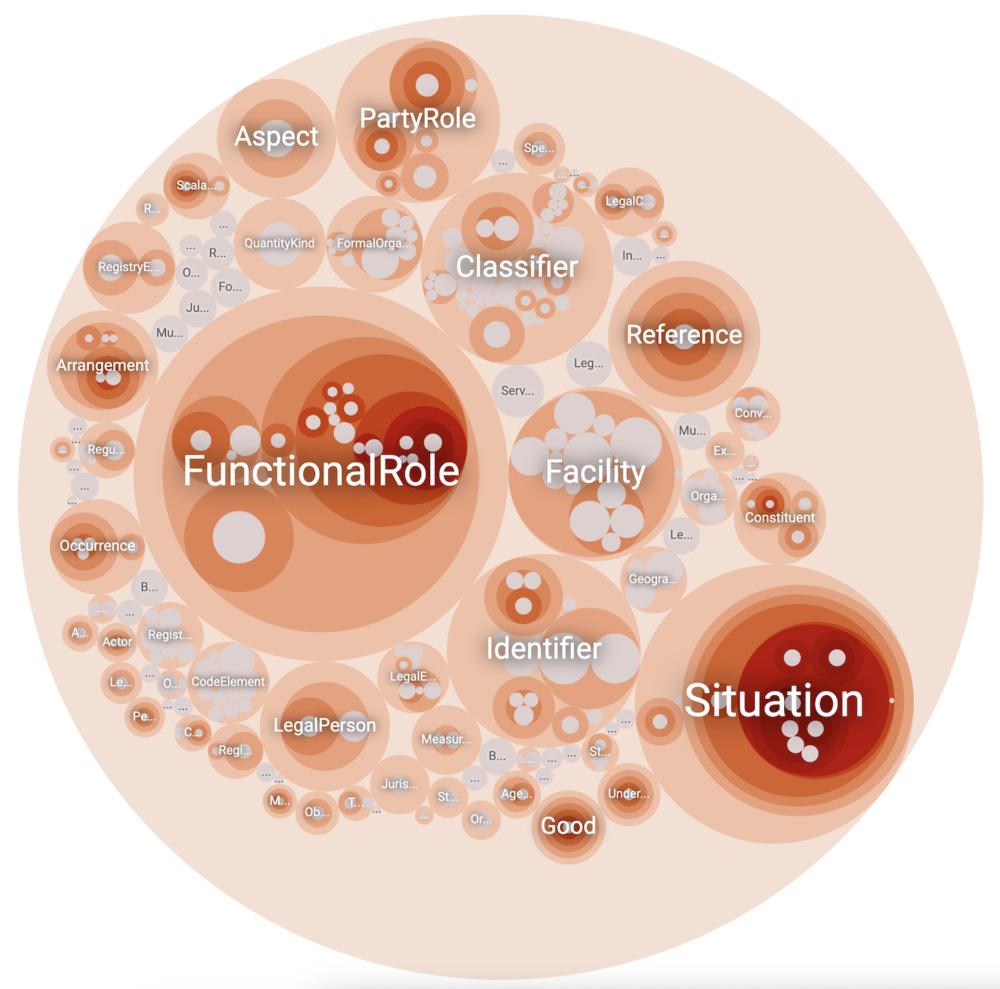

# fibo-mcp

Give your financial agent access to the Financial Industry Business Ontology (FIBO).



## Installation

Paste into Claude Code:
```
Install fibo-mcp from https://github.com/NeuroFusionAI/fibo-mcp
```

```bash
git clone https://github.com/NeuroFusionAI/fibo-mcp.git
cd fibo-mcp
uv sync

# Claude Code
claude mcp add --scope user fibo-mcp -- uv run --directory "$(pwd)" main.py

# Restart Claude Code to load the MCP
```

### Diagramming Skill

The repo includes a diagramming skill (`.claude/skills/diagramming-expert/`) for ASCII visualizations.

When installing via Claude Code, ask user:
> Where should I install the diagramming skill?
> - [ ] Project scope only (default - already in .claude/skills/)
> - [ ] User scope (all projects) - copy to ~/.claude/skills/

```bash
# User scope (optional)
cp -r .claude/skills/diagramming-expert ~/.claude/skills/
```

### Other MCP Clients (Cursor, Claude Desktop, etc.)

Add to your MCP config file:

```json
{
  "mcpServers": {
    "fibo-mcp": {
      "command": "uv",
      "args": ["run", "--directory", "/path/to/fibo-mcp", "main.py"]
    }
  }
}
```

### Uninstall

```bash
# Claude Code
claude mcp remove fibo-mcp

# Remove user-scope skill (if installed)
rm -rf ~/.claude/skills/diagramming-expert
```

## Examples

### "What is money?"

<table width="100%">
<tr>
<th width="50%">Without fibo-mcp</th>
<th width="50%">With fibo-mcp</th>
</tr>
<tr>
<td valign="top">

Money is a medium of exchange, a store of value, and a unit of account that facilitates economic transactions.

**Forms of Money:**
- Commodity money - Physical items with intrinsic value (gold, silver)
- Fiat money - Government-issued currency not backed by commodity (USD, EUR)
- Digital/Electronic money - Bank deposits, digital payments
- Cryptocurrencies - Decentralized digital assets like Bitcoin

Money's value ultimately rests on collective trust and acceptance.

</td>
<td valign="top">

*Claude automatically queries FIBO...*

According to FIBO:

**Currency**: *"medium of exchange value, defined by reference to the geographical location of the monetary authorities responsible for it"*

FIBO distinguishes:
- **Currency** - the medium of exchange itself
- **Monetary Amount** - a quantity denominated in a currency
- **Currency Identifier** - ISO 4217 codes (USD, EUR, etc.)

</td>
</tr>
</table>

### "What is a country?"

<table width="100%">
<tr>
<th width="50%">Without fibo-mcp</th>
<th width="50%">With fibo-mcp</th>
</tr>
<tr>
<td valign="top">

A country is a distinct territorial body or political entity with its own government, defined borders, and sovereignty.

**Key characteristics:**
- Defined territory
- Permanent population
- Government
- Sovereignty
- Recognition by other countries

There are approximately 195 recognized countries today.

</td>
<td valign="top">

*Claude automatically queries FIBO...*

**Sovereign State**: *"non-physical juridical entity that is represented by one centralized government that has sovereignty over a geographic area"*

Key characteristics from FIBO:
- Represented by one centralized government
- Has a permanent population
- Has defined territory
- Has capacity to enter into relations with other sovereign states

Related: **Federated Sovereignty**, **Regional Sovereignty**

</td>
</tr>
</table>

### "What is corporate?"

<table width="100%">
<tr>
<th width="50%">Without fibo-mcp</th>
<th width="50%">With fibo-mcp</th>
</tr>
<tr>
<td valign="top">

A corporation is a legal entity separate from its owners:

- **Limited liability** - Owners not personally responsible for debts
- **Perpetual existence** - Continues regardless of ownership changes
- **Legal personhood** - Can own property, enter contracts, sue and be sued
- **Transferable ownership** - Shares can be bought and sold

</td>
<td valign="top">

*Claude automatically queries FIBO...*

**Stock Corporation**: *"corporation that has shareholders, each of whom receives a portion of the ownership of the corporation through shares of stock"*

**Contractually Capable Entity**: *"unique entity that is legally or financially responsible for the performance of financial transactions, or has the legal right in its jurisdiction to enter independently into legal contracts"*

Formation: **Articles of Incorporation**, **Corporate Bylaws**

</td>
</tr>
</table>

## Why FIBO?

Finance has a semantics problem—the same "trade," "counterparty," or "position" can mean different things across desks, systems, vendors, and jurisdictions. FIBO provides a formal, machine-readable ontology (OWL/RDF) so data from contracts, market feeds, and internal systems can be integrated and queried with shared meaning.

Contributors include Citigroup, Deutsche Bank, Goldman Sachs, State Street, Wells Fargo, CFTC, US Treasury OFR, and others. Standardized by EDM Council and OMG.

## Remote MCP (OpenAI, etc.)

```bash
# Start HTTP server
uv run main.py --http --port 8000

# Expose via ngrok (in another terminal)
ngrok http 8000
```

```python
from openai import OpenAI

client = OpenAI()
resp = client.responses.create(
    model="gpt-5.2",
    tools=[{
        "type": "mcp",
        "server_label": "fibo",
        "server_url": "https://your-ngrok-url.ngrok.io/mcp",
        "require_approval": "never",
    }],
    input="What is a derivative according to FIBO?",
)
```

## Technical Details

| | |
|---|---|
| Data | 129,990 triples (299 RDF/OWL files) |
| Coverage | 3,371 classes, 16,057 entities, 1,259 properties |
| Cache | `./data/fibo.ttl` (auto-downloaded on first run) |
| Update | `uv run main.py --force-download` |

## References

- [FIBO Specification](https://spec.edmcouncil.org/fibo)
- [Diagramming Skill](https://github.com/erichowens/some_claude_skills/tree/main/.claude/skills/diagramming-expert)
