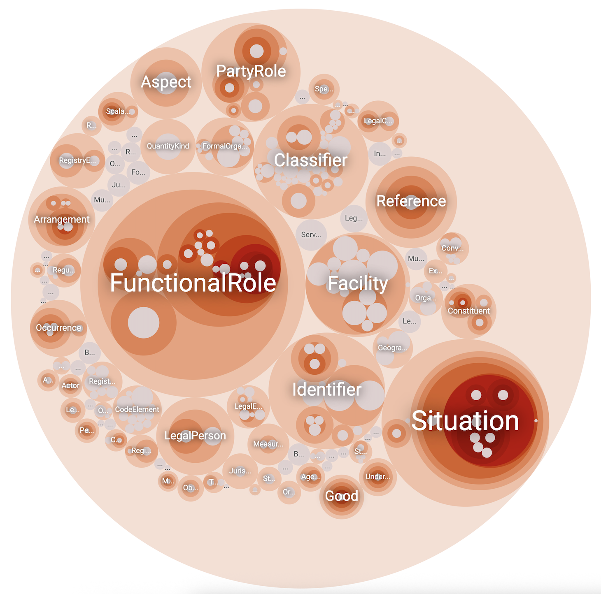

# fibo-mcp

Give your financial agent access to the Financial Industry Business Ontology (FIBO).



You can also ask an AI assistant to install it:
```
Install fibo-mcp from https://github.com/NeuroFusionAI/fibo-mcp
```

## Installation

If already in fibo-mcp directory, skip clone and cd. Run the setup commands from the fibo-mcp directory:
```bash
git clone https://github.com/NeuroFusionAI/fibo-mcp.git && cd fibo-mcp
uv sync
```

Connect it to your MCP client using the matching command below, or the JSON configuration further down.

**Codex**
```bash
codex mcp add fibo-mcp -- uv run --directory "$(pwd)" main.py
```

**Claude Code**
```bash
claude mcp add --scope user fibo-mcp -- uv run --directory "$(pwd)" main.py
```

Restart or reload your client if needed to load the MCP.

### With OWL-RL Materialization (Recommended for symbolic reasoning)

Materialization applies the OWL-RL profile and caches the inferred graph. Triple
counts depend on the pinned FIBO revision. OWL-RL is a scalable subset of OWL,
not unrestricted or complete OWL reasoning.

```bash
# Build cache first (Ctrl+C after "Ready to serve")
uv run main.py --materialize
```

Then append `--materialize` after `main.py` in your client's launch command or configuration.

### Other MCP Clients (Cursor, Claude Desktop, etc.)

For clients using `mcpServers` JSON, add this to your MCP config file and replace `/path/to/fibo-mcp` with the absolute checkout path:

```json
{
  "mcpServers": {
    "fibo-mcp": {
      "command": "uv",
      "args": ["run", "--directory", "/path/to/fibo-mcp", "main.py"]
    }
  }
}
```

With materialization:
```json
{
  "mcpServers": {
    "fibo-mcp": {
      "command": "uv",
      "args": ["run", "--directory", "/path/to/fibo-mcp", "main.py", "--materialize"]
    }
  }
}
```

> Build cache first: `uv run main.py --materialize` (Ctrl+C after "Ready to serve")

### Uninstall

Remove `fibo-mcp` from your client's MCP configuration. For Claude Code:

```bash
claude mcp remove fibo-mcp
```

## Tools

Use `search(term)` to find candidate FIBO classes, `inspect(identifier)` to check
their definitions and direct relationships, and `sparql(query)` for specific
graph queries. Returned identifiers can be reused across all three tools.

Use FIBO when terminology or ontology relationships help the task. It does not
provide company financials, market prices, or forecasts, and a search match does
not establish that two concepts are equivalent.

Search indexes class labels, definitions, and FIBO's synonym, abbreviation,
common-designation and preferred-designation annotations. It also accepts legacy
`skos:altLabel` annotations. Exact labels rank first, then exact ontology
annotations, local terminology hints, and BM25 matches. Ties are stable by class
IRI, and each class appears once. Definitions are returned without truncation.

Each result identifies its match type: `label`, `ontology_annotation`,
`concept_alias` (a local heuristic), or `bm25`. Exact matches include
`matched_text` and `match_source`, the annotation predicate IRI or
`local:CONCEPT_ALIASES`. The `score` field is the lexical BM25 score, not a
probability or the priority used for exact matches. The pinned ontology is
unchanged; these annotations improve lookup rather than adding financial facts.

## Examples

### "What is money?"

<table width="100%">
<tr>
<th width="50%">Without fibo-mcp</th>
<th width="50%">With fibo-mcp</th>
</tr>
<tr>
<td valign="top">

Money is a medium of exchange, a store of value, and a unit of account that facilitates economic transactions.

**Forms of Money:**
- Commodity money - Physical items with intrinsic value (gold, silver)
- Fiat money - Government-issued currency not backed by commodity (USD, EUR)
- Digital/Electronic money - Bank deposits, digital payments
- Cryptocurrencies - Decentralized digital assets like Bitcoin

Money's value ultimately rests on collective trust and acceptance.

</td>
<td valign="top">

*Claude automatically queries FIBO...*

According to FIBO:

**Currency**: *"medium of exchange value, defined by reference to the geographical location of the monetary authorities responsible for it"*

FIBO distinguishes:
- **Currency** - the medium of exchange itself
- **Monetary Amount** - a quantity denominated in a currency
- **Currency Identifier** - ISO 4217 codes (USD, EUR, etc.)

</td>
</tr>
</table>

### "What is a country?"

<table width="100%">
<tr>
<th width="50%">Without fibo-mcp</th>
<th width="50%">With fibo-mcp</th>
</tr>
<tr>
<td valign="top">

A country is a distinct territorial body or political entity with its own government, defined borders, and sovereignty.

**Key characteristics:**
- Defined territory
- Permanent population
- Government
- Sovereignty
- Recognition by other countries

There are approximately 195 recognized countries today.

</td>
<td valign="top">

*Claude automatically queries FIBO...*

**Sovereign State**: *"non-physical juridical entity that is represented by one centralized government that has sovereignty over a geographic area"*

Key characteristics from FIBO:
- Represented by one centralized government
- Has a permanent population
- Has defined territory
- Has capacity to enter into relations with other sovereign states

Related: **Federated Sovereignty**, **Regional Sovereignty**

</td>
</tr>
</table>

### "What is corporate?"

<table width="100%">
<tr>
<th width="50%">Without fibo-mcp</th>
<th width="50%">With fibo-mcp</th>
</tr>
<tr>
<td valign="top">

A corporation is a legal entity separate from its owners:

- **Limited liability** - Owners not personally responsible for debts
- **Perpetual existence** - Continues regardless of ownership changes
- **Legal personhood** - Can own property, enter contracts, sue and be sued
- **Transferable ownership** - Shares can be bought and sold

</td>
<td valign="top">

*Claude automatically queries FIBO...*

**Corporation**: *"formal organization that is a legal entity (artificial person) distinct from its owners, created under the jurisdiction of the laws of a state or nation"*

Related subclasses include **Stock Corporation**, **For Profit Corporation**,
and **Not-for-Profit Corporation**.

Formation: **Articles of Incorporation**, **Corporate Bylaws**

</td>
</tr>
</table>

## Why FIBO?

Finance has a semantics problem—the same "trade," "counterparty," or "position" can mean different things across desks, systems, vendors, and jurisdictions. FIBO provides a formal, machine-readable ontology (OWL/RDF) so data from contracts, market feeds, and internal systems can be integrated and queried with shared meaning.

Contributors include Citigroup, Deutsche Bank, Goldman Sachs, State Street, Wells Fargo, CFTC, US Treasury OFR, and others. Standardized by EDM Council and OMG.

## HTTP MCP (local by default)

The HTTP listener binds to `127.0.0.1` by default. Do not expose it directly to
the internet: the server accepts read-only SPARQL and caps returned rows, but it
does not provide application authentication or rate limiting. Put an
authenticated, rate-limited gateway in front of it before any remote use.

```bash
# Start HTTP server
uv run main.py --http --port 8000

```

## Technical Details

| | |
|---|---|
| Data | 299 RDF/OWL source files at the pinned revision; loaded triple count is logged at startup |
| Base graph | 133,498 triples; 3,346 `owl:Class` subjects; 1,216 typed RDF/OWL properties; 16,665 URI subjects |
| Cache | `./data/fibo.ttl` (base), `./data/fibo_materialized.ttl` (with --materialize) |
| Source revision | `f59157fe156e3d91b1c045222d0a7dc06b7d78a2` by default; override with `FIBO_REVISION` |
| Refresh cache | `uv run main.py --force-download` |

### Server Flags

| Flag | Description |
|------|-------------|
| `--materialize` | Enable OWL-RL inference (adds startup time; the materialized graph is cached) |
| `--bm25-top-k N` | Number of BM25 search results (default: 10) |
| `--force-download` | Re-download the configured FIBO revision |
| `--http` | Run as HTTP server instead of stdio |
| `--port N` | HTTP server port (default: 8000) |

## License

fibo-mcp is distributed under the [MIT License](LICENSE).

## References

- [FIBO Specification](https://spec.edmcouncil.org/fibo)

## Citation

If you use **fibo-mcp** in your research or software, please cite it using the
following BibTeX entry:

**BibTeX**
```bibtex
@software{jung_fibo_mcp,
  author  = {Jung, Anthony W.},
  title   = {{fibo-mcp}: Open-source {MCP} for financial ontology},
  url     = {https://github.com/NeuroFusionAI/fibo-mcp},
  license = {MIT}
}
```

**APA**
```
Jung, A. W. (n.d.). *fibo-mcp: Open-source MCP for financial ontology* [Computer software]. https://github.com/NeuroFusionAI/fibo-mcp
```

Download [CITATION.bib](CITATION.bib), or use **Cite this repository** on GitHub
to export a citation from [CITATION.cff](CITATION.cff). For reproducibility,
also report the release tag or commit SHA used in your work.
